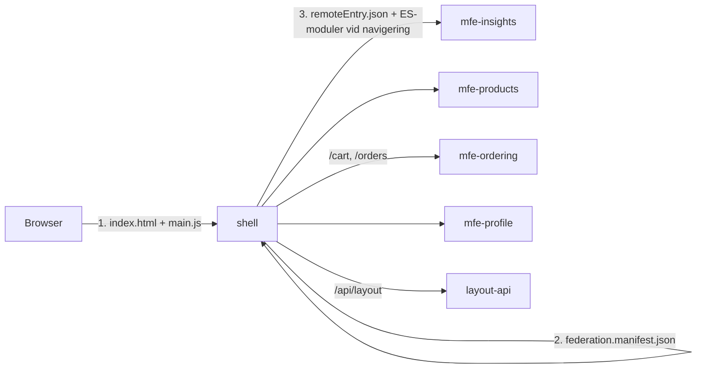
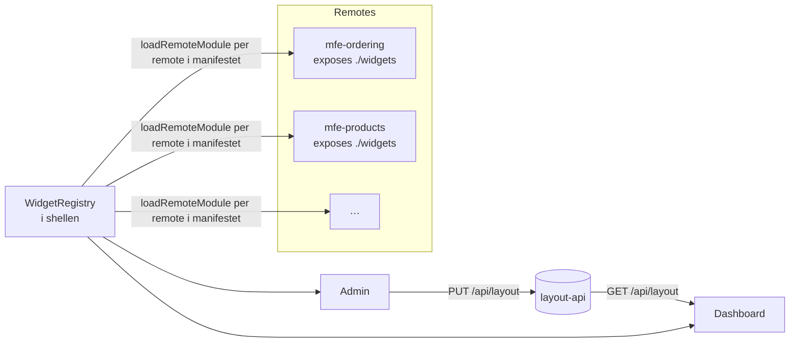

# MFE Store: microfrontends med Nx + Angular + Native Federation

En proof of concept som visar hur ~5 team bygger och deployar var sin microfrontend oberoende av varandra,
men utvecklar i **ett** monorepo där allt startar med ett kommando.

| Del | Version |
| --- | --- |
| Angular + Angular Material | 22.2 |
| Nx | 23.2 |
| @angular-architects/native-federation | 22.2 |
| Tailwind CSS | 4.3 |

## Team och appar

| App | Team | Route i shellen | Dev-port | Docker-port |
| --- | --- | --- | --- | --- |
| `shell` (host) | Team Platform | `/` (dashboard), `/admin` | 4200 | 8080 |
| `mfe-insights` | Team Insights | `/insights` | 4201 | 8091 |
| `mfe-products` | Team Catalog | `/products` | 4202 | 8092 |
| `mfe-ordering` | Team Checkout | `/cart`, `/orders` | 4203 | 8093 |
| `mfe-profile` | Team Identity | `/profile` | 4205 | 8095 |
| `layout-api` (Node) | Team Platform | `/api/*` via shellen | 3333 | intern |

Alla remotes bidrar dessutom med **widgets** till dashboarden, se [Widgets och dynamisk dashboard](#widgets-och-dynamisk-dashboard).

## Kom igång

```bash
npm install
npm start            # = nx serve shell → startar shell + alla 5 remotes + layout-api
```

Lokalt lägger dev-servern på `Authorization: Bearer <token>` och `X-Custom-Info` på alla `/api`- och
`/gateway`-anrop, så ingen riktig inloggning behövs. Användarna står i
[apps/dev-proxy/dev-users.json](apps/dev-proxy/dev-users.json).

Första gången du öppnar en dev-server skickas du till http://localhost:4299, inloggningssidan i appen
[dev-proxy](apps/dev-proxy). Där väljer du användare. Valet sparas i cookien `dev-user` och du skickas tillbaka
till sidan du kom från. Byt användare genom att gå till 4299 igen. dev-proxy startas av `npm start`, eller
fristående med `nx serve dev-proxy`. Den är bara ett dev-verktyg och deployas inte.

dev-proxy samlar allt som rör den lokala dev-miljön mot backend: användarna, inloggningssidan och
[proxy-configen](apps/dev-proxy/proxy/proxy.conf.mjs) som shellen och alla remotes dev-servrar använder.

- Cookies skiljer inte på portar, så valet gäller alla dev-servrar på localhost.
- Valet gäller per webbläsare, så du kan vara `anna` i en webbläsare och `kim` i en annan.
- Utan vald användare svarar `/api`- och `/gateway`-anrop med 401.
- "Logga ut" i användarmenyn i shellen går till `/logout`. Lokalt rensar dev-proxyn cookien och skickar dig till
  inloggningssidan. I test måste den riktiga inloggningen svara på samma sökväg.
- dev-users.json läses vid varje anrop, så ändringar gäller utan omstart. Inloggningssidan laddas om av sig själv.

Öppna http://localhost:4200. Slå av/på **"Visa MFE-gränser"** i menyn för att se vilken del som kommer från
vilket team, version och vilken server koden faktiskt laddades från.

Microfrontends körs **bara i shellen**, som håller den inloggade användarens profil och behörigheter. En remote
exponerar sina routes och widgets, men har ingen egen app att starta. Öppnar du en remotes port direkt
(t.ex. http://localhost:4203) visas bara en hänvisning till shellen.

Övriga kommandon:

```bash
npm run build        # bygg alla appar (Nx-cachat)
npm test             # alla enhetstester (Vitest)
npm run lint         # ESLint inkl. teamgränser
npm run affected     # lint/test/build för bara det som ändrats (kräver git)
npm run graph        # beroendegraf i webbläsaren
```

## Mappstruktur

```
apps/
  shell/                     # Host: layout, navigation, routing till remotes (Team Platform)
    public/federation.manifest.json   # remote-namn → URL (skrivs över i Docker)
    src/app/dashboard/       # Widget-registry, layout-store, dashboard-sida
    src/app/admin/           # Adminsida: drag & drop-editor för dashboarden
  mfe-<namn>/                # En deploybar enhet per team (inte per domän)
    federation.config.mjs    # vad appen exponerar och delar
    src/app/
      app.routes.ts          # En domän: exponeras som ./routes, shellen mountar dem under domänens prefix
      <domän>.routes.ts      # Flera domäner: en route-modul per domän, exponeras som ./<domän>
      app.ts, app.css        # Rot-komponent: MFE-gräns + teamets Tailwind-utilities
      widgets/               # Exponeras som ./widgets: katalog + widget-komponenter
      mfe-info.ts            # namn/team/version (visas i UI:t)
      *.ts                   # teamets egna features (när remoten bara har en domän)
  layout-api/                # Node-tjänst som sparar dashboard-layouten (Team Platform)
libs/
  <domän>/feature/           # En domäns sidor och routes när remoten har flera domäner (t.ex. cart, orders)
  shared/
    ui/                      # Presentationskomponenter + Material-tema + Tailwind-brygga
    data-access/             # Signal-stores som delas som singletons (varukorg, ordrar, användare)
    util/                    # Modeller, formatters, typad event-bus. Inga beroenden.
tools/docker/                # Gemensam Dockerfile, nginx-config, manifest-skript
docker-compose.yml
.github/                     # CI (bygger bara påverkade appar) + CODEOWNERS
```

Därför ser den ut så här:

- **`apps/` = det som deployas, `libs/` = det som delas.** En app per microfrontend gör att varje team
  har en egen build, en egen Docker-image och en egen release.
- **`libs/<scope>/<type>`** följer Nx-konventionen. När ett team växer lägger de egna libs under
  `libs/<domän>/feature-*`, `data-access-*` osv. (t.ex. `libs/cart/feature-checkout`) istället för att
  allt ligger i appen.
- **Teamgränser kontrolleras av lint.** Varje projekt har taggar (`scope:cart`, `type:ui` …) och
  `@nx/enforce-module-boundaries` i [eslint.config.mjs](eslint.config.mjs) stoppar t.ex. Team Cart
  från att importera Team Products kod, eller `util` från att bero på `data-access`.
- **Ägarskap** står i [.github/CODEOWNERS](.github/CODEOWNERS).

## Så hänger det ihop



1. **Shellen** kör `initFederation('federation.manifest.json')` i [main.ts](apps/shell/src/main.ts).
   Manifestet hämtas vid runtime, så samma build kan peka på olika remote-URL:er i olika miljöer.
2. Varje remote **exponerar sina routes**, `./routes` från sin `app.routes.ts`
   ([exempel](apps/mfe-products/src/app/app.routes.ts)). Shellen mountar dem med
   `loadChildren: loadRemoteRoutes('mfe-products')` i [app.routes.ts](apps/shell/src/app/app.routes.ts).
   Teamet äger allt under domänens URL-prefix, inklusive egna underroutes (`/products/:id`).
   En remote med flera domäner exponerar en route-modul per domän, se
   [En remote, flera domäner](#en-remote-flera-domäner).
3. **Om en remote är nere** visar shellen en fallback för just den delen, och resten fungerar
   ([native-federation.ts](apps/shell/src/app/federation/native-federation.ts)).
4. **Delade beroenden** (Angular, Material, RxJS, och alla `@mfe/shared/*`-libs via path mappings i
   `tsconfig.base.json`) laddas **en gång** som singletons.

### En remote, flera domäner

En remote är en **deploybar enhet per team**, inte per domän. Ett team som äger flera domäner och släpper dem
tillsammans har en remote. Varje remote kostar en image, en deployment och en version att hålla reda på, så
den delas bara när delarna behöver släppas oberoende av varandra, t.ex. för att de ägs av olika team.

[mfe-ordering](apps/mfe-ordering) visar hur det ser ut. Den äger domänerna varukorg och ordrar:

```
apps/mfe-ordering/src/app/
  cart.routes.ts       # exponeras som ./cart:   App + cartRoutes
  orders.routes.ts     # exponeras som ./orders: App + ordersRoutes
  app.ts, app.css      # MFE-gräns + Tailwind för båda domänerna (@source pekar på libs/cart och libs/orders)
  widgets/             # cart.summary, orders.recent
libs/cart/feature/     # varukorgens sidor och routes (scope:cart)
libs/orders/feature/   # ordrarnas sidor, routes och orderstatus (scope:orders)
```

- **URL:erna följer domänerna**, inte remoten eller teamet. Shellen mountar varje domän för sig:
  `loadRemoteRoutes('mfe-ordering', './cart')` under `/cart` och `'./orders'` under `/orders`.
- **Domänerna ligger i libs** med egna `scope:`-taggar. Lint stoppar dem från att importera varandra, även
  inom samma remote. Bara remoten (`scope:ordering`) får använda båda.
- **En domän kan flyttas** till en annan remote om den byter team: den nya remoten importerar libbet och
  exponerar dess routes, och shellen byter remote-namn på en rad. Widget-id:n (`orders.recent`) följer med
  och ändras aldrig.

### Kommunikation mellan microfrontends

| Behov | Mönster | Exempel |
| --- | --- | --- |
| Delat state som flera läser | Signal-store i `@mfe/shared/data-access` (singleton) | Products lägger i `CartStore`, shellens badge och Cart läser samma instans |
| Notifiera andra, fire-and-forget | `publishMfeEvent` / `onMfeEvent` (DOM-events) | Cart publicerar `order:placed`, shellen visar en snackbar |
| Navigera till annan MFE | Vanlig URL via routern | `router.navigateByUrl('/orders')` – aldrig import av annat teams kod |

> ⚠️ Delade libs är singletons: den version som laddas först (shellens) gäller. Håll därför det publika
> API:t i `libs/shared/*` bakåtkompatibelt, och låt ändringar där gå igenom Team Platform.

### Styling: Angular Material + Tailwind

- Ett enda **Material 3-tema** i [libs/shared/ui/src/styles/_theme.scss](libs/shared/ui/src/styles/_theme.scss)
  inkluderas globalt av shellen och gäller därmed alla remotes. Ljust/mörkt följer OS:et
  eller valet på profilsidan.
- [tailwind-theme.css](libs/shared/ui/src/styles/tailwind-theme.css) mappar Tailwind-färger till Materials
  tokens: `bg-primary`, `bg-surface-container`, `text-on-surface-variant` osv. följer temat automatiskt.
- **Viktigt för microfrontends:** en remotes *globala* stilar följer inte med in i shellen, bara komponentstilar
  gör det. Därför bär varje remotes rot-komponent, `App`, sina egna Tailwind-utilities
  ([app.css](apps/mfe-products/src/app/app.css), `ViewEncapsulation.None`).
  Shellen behöver aldrig veta vilka klasser en remote använder, så deployer förblir oberoende.
- Tailwind ligger i CSS cascade layers och Material inte. Vill du **skriva över** en Material-stil med
  Tailwind behöver du `!`-prefix, t.ex. `class="!w-64"`.

## Widgets och dynamisk dashboard

Översikten (`/`) består av widgets som **teamen själva publicerar**. Vilka widgets som visas, i vilken ordning
och hur stora de är bestäms på **adminsidan** (`/admin`) och sparas i `layout-api`. Inget av detta kräver att
shellen byggs om.



1. **Teamet publicerar.** Varje remote exponerar `./widgets`
   ([exempel](apps/mfe-ordering/src/app/widgets/index.ts)): en lista med id, titel, beskrivning, ikon,
   standardstorlek och `load()` som lazy-laddar komponenten. Kontraktet (`WidgetDefinition`) ligger i
   [@mfe/shared/ui](libs/shared/ui/src/lib/widgets/widget-definition.ts).
2. **Shellen upptäcker.** [WidgetRegistry](apps/shell/src/app/dashboard/widget-registry.ts) laddar `./widgets`
   från varje remote i `federation.manifest.json`. Den som är nere hoppar registret över och rapporterar.
3. **Layout är data.** [layout-api](apps/layout-api/src/main.ts) sparar en ordnad lista av
   `{ instanceId, widgetId, cols, rows }` i ett 4-kolumners grid. Formatet valideras av samma funktion
   (`sanitizeWidgetPlacements`) i [@mfe/shared/util](libs/shared/util/src/lib/dashboard-layout.ts).
4. **Dashboarden renderar.** [WidgetSlot](apps/shell/src/app/dashboard/widget-slot.ts) ger varje widget en
   ram från plattformen (titel, laddning, fel) och laddar komponenten först när den faktiskt ska visas.
5. **Admin redigerar.** [DashboardEditor](apps/shell/src/app/admin/dashboard-editor.ts) visar katalogen per
   team, och man kan lägga till, ta bort, dra för att flytta (Angular CDK) och ändra storlek.

**Motståndskraft:** är en remote nere visar just dess widgets "inte tillgänglig". Är `layout-api` nere
visar dashboarden alla widgets i standardstorlek med en varning.

**Så lägger ett team till en ny widget:** skapa komponenten i `src/app/widgets/`, lägg till den i
`widgets/index.ts` och deploya remoten. Den dyker upp i adminkatalogen direkt.

- Widget-id (`orders.recent`) sparas i layouter. Byt aldrig namn på ett id, lägg hellre till ett nytt.
- En widget renderas utanför teamets `App` och måste därför själv ha
  `styleUrl: '../app.css'` och `encapsulation: ViewEncapsulation.None` för att
  Tailwind ska fungera. Angular injicerar identiska stilar bara en gång.
- Widgets ska vara självständiga: de läser data från delade stores eller eget API och navigerar via URL:er.

I dev proxar Angulars dev-server `/api` till `layout-api` ([proxy.conf.mjs](apps/dev-proxy/proxy/proxy.conf.mjs)).
I Docker gör shellens nginx samma sak ([41-api-proxy.sh](tools/docker/41-api-proxy.sh)), så frontend-koden
använder alltid samma relativa URL.

### Backend-tjänster via `/gateway`

Services anropar backend med samma relativa URL som i test, till exempel `/gateway/profile/api/v1/profil`. I test
ligger gatewayen på samma origin som sidan. Lokalt skickar dev-proxyn `/gateway/<tjänst>/…` vidare till
`localhost:<port>/<tjänst>/…`. Ingen bas-URL per miljö behövs, och samma image fungerar överallt.

En ny tjänst blir en ny rad i `GATEWAY_SERVICES` i [proxy.conf.mjs](apps/dev-proxy/proxy/proxy.conf.mjs).

## Docker och oberoende deploys

Alla appar använder samma parametriserade [Dockerfile](tools/docker/Dockerfile) (`--build-arg APP=…`) men blir
separata images: target `web` (nginx) för Angular-apparna och `api` (Node) för `layout-api`.
`npm ci`-lagret är identiskt och cachas mellan dem. Layouten sparas i volymen `layout-data`.

```bash
npm run docker:up        # = docker compose up --build -d
open http://localhost:8080
```

**Demo 1: deploya bara ett team**

```bash
# ändra version: '1.0.0' → '1.1.0' i apps/mfe-ordering/src/app/mfe-info.ts
docker compose up -d --build mfe-ordering
```

Ladda om shellen: varukorgen och ordrarna visar v1.1.0, alla andra är orörda (kolla `docker compose ps`, bara
mfe-ordering har startats om).

**Demo 2: en remote går ner**

```bash
docker compose stop mfe-ordering  # /cart, /orders och deras widgets visar fallback, resten fungerar
docker compose start mfe-ordering
docker compose stop layout-api    # dashboarden visar alla widgets i standardstorlek
docker compose start layout-api
```

**Demo 3: hybrid, lokal dev-server i den "deployade" miljön**

```bash
npx nx serve mfe-ordering
MFE_ORDERING_URL=http://localhost:4203/remoteEntry.json docker compose up -d shell
```

Shellen-containern skriver `federation.manifest.json` från `MFE_REMOTE_*`-miljövariabler vid start
([40-federation-manifest.sh](tools/docker/40-federation-manifest.sh)). Samma shell-image kan därför
användas i alla miljöer. nginx sätter CORS-headers, `no-cache` på `remoteEntry.json` och `immutable` på
hashade bundles ([nginx.conf](tools/docker/nginx.conf)).

### CI och release

[.github/workflows/ci.yml](.github/workflows/ci.yml) kör `nx affected -t lint test build` på varje PR och på
`develop`. Den bygger inga images.

En release gäller **en app** och tas ut som `release/<app>/<version>` från `develop`, till exempel
`release/mfe-ordering/1.4.0`. Release-pipelinen ([release.Jenkinsfile](tools/jenkins/release.Jenkinsfile)) bygger,
testar och deployar bara den appen, först till test och efter godkännande till produktion. Där taggas
`<app>@<version>`, och taggarna visar vad som ligger i produktion. Hotfixar tas ut som `hotfix/<app>/<version>`
från appens produktionstagg. Ändringar i `libs/shared/*` ska ut med shellen innan en remote släpps med dem.
Varför och hur: [ADR 0001](docs/adr/0001-release-per-app.md).

## Lägga till en ny microfrontend

Allt skapas med Nx-generatorer:

```bash
npx nx g @nx/angular:application apps/mfe-reviews --prefix=rev --port=4206 \
  --tags="type:app,scope:reviews" --bundler=esbuild --style=scss --zoneless \
  --e2eTestRunner=none --unitTestRunner=vitest-angular
npx nx g @nx/angular:add-linting --projectName=mfe-reviews --projectRoot=apps/mfe-reviews --prefix=rev
npx nx g @angular-architects/native-federation:init --project=mfe-reviews --port=4206 --type=remote
```

Sedan:

1. Kopiera mönstret från en befintlig remote: `main.ts`, `app.ts`, `app.css`, `app.routes.ts`, `widgets/` och
   `mfe-info.ts`. Ta bort det generatorn skapade för att köra appen fristående (`bootstrap.ts`, `app.config.ts`,
   `tailwind.css` och dess rad i `esbuild.options.styles`). Exponera `./routes` (`app.routes.ts`) och `./widgets`
   i `federation.config.mjs`, och sätt `test.options.buildTarget` till `mfe-reviews:esbuild:development` i
   `project.json`.
2. Lägg till remoten i `apps/shell/public/federation.manifest.json`, `app.routes.ts` och `layout/navigation.ts`.
3. Lägg till `scope:reviews` i `depConstraints` i `eslint.config.mjs`, en tjänst i `docker-compose.yml`
   och en rad i `CODEOWNERS`.

(Nästa naturliga steg är att samla detta i en egen Nx-generator: `nx g @nx/plugin:generator`.)

## Kända saker

- **Node 24.16 kan ibland krascha** (`FATAL ERROR: v8::ToLocalChecked Empty MaybeLocal`) när flera
  Native Federation-byggen kallstartar samtidigt, t.ex. första `npm start`. Det är en Node-bugg; kör kommandot igen.
- `federation.config.mjs` använder NF:s default-bundling av delade paket. Schematicens `build: 'package'`
  togs bort eftersom den bygger paketen parallellt in i samma cache-katalog och gav sporadiska `ENOENT`-fel
  i Docker/CI.
- `nx affected` kräver ett git-repo med minst en commit.
